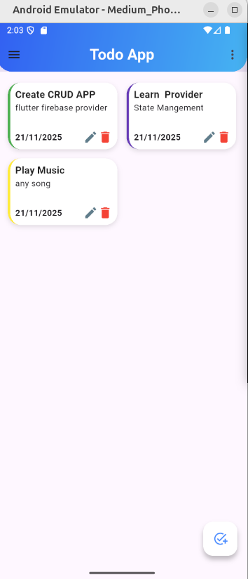
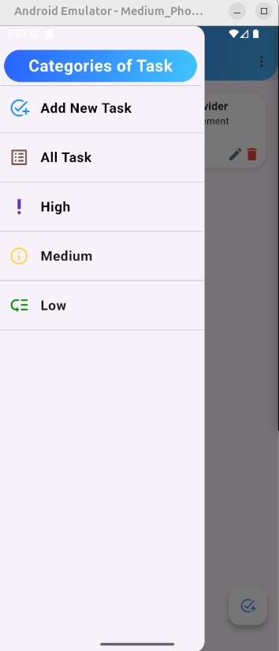
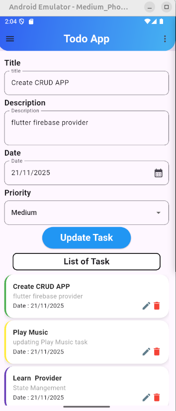
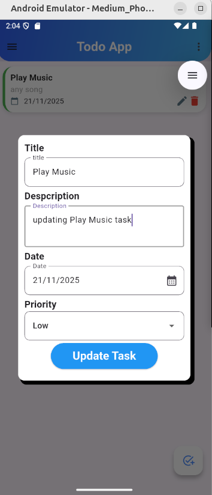
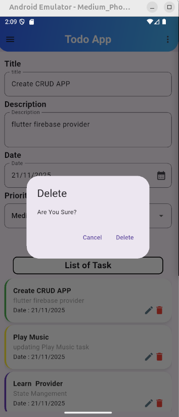
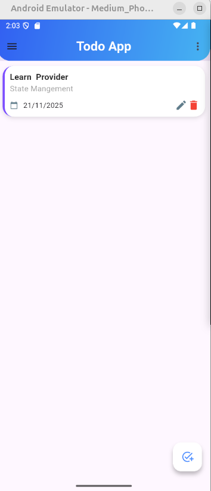
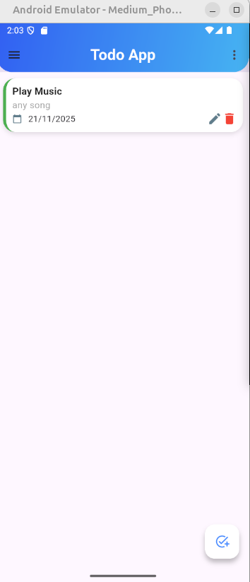
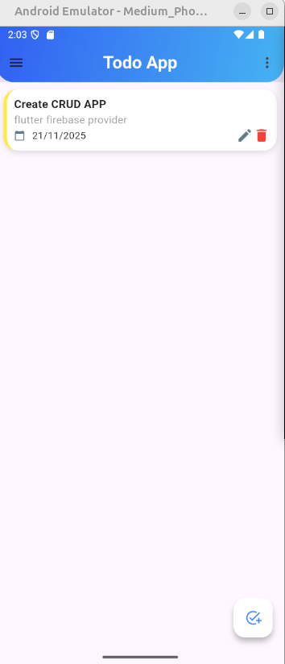

# CRUD APP : Flutter +Provider + Firestore 

CRUD App (Flutter + Provider + Firestore)
A simple and efficient task-management application built using Flutter, Provider for state management, and Cloud Firestore as the backend. Users can add, edit, and delete tasks with real-time updates. The app includes a Home Screen displaying all tasks and dedicated screens that categorize tasks based on priority levels: High, Medium, and Low.

Features

🔹 Create, update, and delete tasks

🔹 Priority-based task filtering (High, Medium, Low)

🔹 State management using Provider

🔹 Firestore integration for real-time data

## Screenshots

&nbsp;&nbsp;&nbsp;

&nbsp;&nbsp;&nbsp;

